# Payment & Checkout Flow — Technical Architecture Guide

> **Audience**: Senior developers, architects, and engineers working on the Well Pharmacy e-commerce platform.
> **Last updated**: March 2026

---

## Table of Contents

1. [System Architecture Overview](#1-system-architecture-overview)
2. [Frontend Checkout Payment Flow](#2-frontend-checkout-payment-flow)
3. [Payment Methods — What's Active vs. Inherited](#3-payment-methods--whats-active-vs-inherited)
4. [Braintree Integration (Full Stack)](#4-braintree-integration-full-stack)
5. [Order Lifecycle & Payment State Machine](#5-order-lifecycle--payment-state-machine)
6. [Webhook & Backend Processing — Service Responsibilities](#6-webhook--backend-processing--service-responsibilities)
7. [Sequence Diagrams](#7-sequence-diagrams)
8. [Payment Capture & Settlement](#8-payment-capture--settlement)
9. [External Service Integrations](#9-external-service-integrations)
10. [Key File Reference](#10-key-file-reference)

---

## 1. System Architecture Overview

The Well Pharmacy e-commerce platform is built on **BigCommerce** with a custom checkout frontend and a microservices backend running on AWS. **Braintree** is the sole payment gateway.

### Services Involved in Payment Flow

| Service | Tech | Role in Payment Flow |
|---------|------|------|
| **bigcommerce-custom-checkout** | React/TypeScript, Nx monorepo | Custom checkout UI — **fork of [bigcommerce/checkout-js](https://github.com/bigcommerce/checkout-js)** with Well-specific customizations. Collects payment via Braintree SDK. Contains 70+ inherited payment method components (see [Section 3](#3-payment-methods--whats-active-vs-inherited)) |
| **well-pharmacy-theme** | BigCommerce Stencil, React | Storefront theme — also includes `braintree-web-drop-in` |
| **shop-webhooks** | Go, AWS Lambda | **Primary webhook processor** — handles all order events, payment decision tree, captures via BC API |
| **rule_engine** | Python, AWS Lambda | **Payment API endpoints only** — direct Braintree settlement, void, subscription sale transactions (webhook handlers are legacy/not deployed) |
| **services-bookwell** | React/TypeScript, Redux, Apollo | **Pharmacist admin panel** (aka BookWell / ServOS) — used by 700+ stores to approve/reject orders and products, manage ID checks. Triggers payment capture/void indirectly via clinical-review API |
| **clinical-review** | Go, MySQL | Order storage, pharmacist review backend (CRP) — receives approve/reject from services-bookwell, calls rule_engine for payment capture/void |
| **users-authentication** | Go, AWS Cognito | User auth, customer profile management |
| **api-proxy** | Traefik | Reverse proxy for internal APIs |

### High-Level Architecture

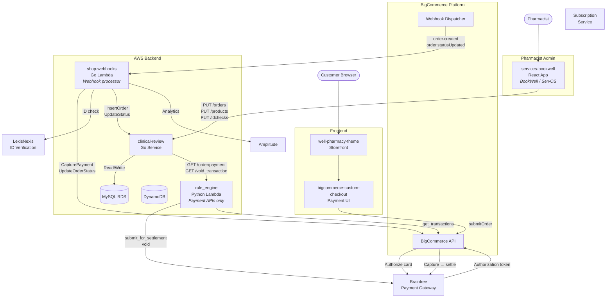

### How It All Connects

1. **Customer** fills in payment details in the custom checkout (React app)
2. **BigCommerce Checkout SDK** sends payment data to BigCommerce, which **authorizes** the card via Braintree (card hold, no charge yet)
3. BigCommerce fires **webhooks** (`order.created`, `order.statusUpdated`) to the `shop-webhooks` Go Lambda
4. The Go handler **decides** whether to capture payment immediately or require pharmacist review
5. Payment is either **captured** (via BigCommerce API → Braintree) or routed to **manual verification**
6. For orders requiring manual verification, **pharmacists** use `services-bookwell` (BookWell/ServOS React app) to review, approve, or reject products — these actions call the `clinical-review` Go service API
7. `clinical-review` then calls `rule_engine` Python API endpoints to **settle** or **void** the payment directly with Braintree

---

## 2. Frontend Checkout Payment Flow

The custom checkout is a React/TypeScript Nx monorepo at `bigcommerce-custom-checkout/`. It uses the `@bigcommerce/checkout-sdk` (v1.466.0) to interact with BigCommerce's payment infrastructure.

### Component Hierarchy

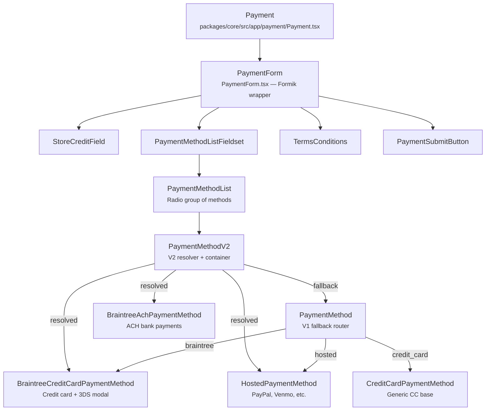

### Payment Method Resolution (Strategy Pattern)

The checkout uses a two-tier resolution system to pick the right payment component:

**V2 Resolution** ([PaymentMethodV2.tsx](https://github.com/welldigital/bigcommerce-custom-checkout/blob/master/packages/core/src/app/payment/paymentMethod/PaymentMethodV2.tsx)):
```typescript
// Uses resolveComponent() to dynamically find the component
// from the generated integration index
const ResolvedPaymentMethod = resolveComponent(query, paymentMethods);

// Falls back to V1 for legacy methods (Mollie, etc.)
if (!ResolvedPaymentMethod) {
    return <PaymentMethodV1 {...props} />;
}
```

**V1 Resolution** ([PaymentMethod.tsx:72-240](https://github.com/welldigital/bigcommerce-custom-checkout/blob/master/packages/core/src/app/payment/paymentMethod/PaymentMethod.tsx#L72-L240)) — a large `if/else` chain:

```typescript
// Line 170: Braintree credit card
if (method.id === PaymentMethodId.Braintree) {
    return <BraintreeCreditCardPaymentMethod {...props} />;
}

// Line 127-144: Checkout.com methods (if configured in BigCommerce)
if (method.gateway === PaymentMethodId.Checkoutcom) {
    if (method.id === 'credit_card' || method.id === 'card') {
        return <HostedCreditCardPaymentMethod {...props} />;
    }
    // Boleto, iDEAL, SEPA, etc.
    return <CheckoutCustomPaymentMethod {...props} />;
}

// Line 205-218: Hosted methods (PayPal, Venmo, Afterpay, etc.)
if (method.type === PaymentMethodProviderType.Hosted) {
    return <HostedPaymentMethod {...props} />;
}
```

### Payment State Management

Three React contexts drive the payment flow:

| Context | File | Purpose |
|---------|------|---------|
| `CheckoutContext` | [CheckoutContext.tsx](https://github.com/welldigital/bigcommerce-custom-checkout/blob/master/packages/payment-integration-api/src/contexts/checkout-context/CheckoutContext.tsx) | Exposes `checkoutService` (SDK methods) and `checkoutState` (selectors) |
| `PaymentFormContext` | [PaymentFormContext.tsx](https://github.com/welldigital/bigcommerce-custom-checkout/blob/master/packages/payment-integration-api/src/contexts/payment-form-context/PaymentFormContext.tsx) | Exposes `PaymentFormService` for payment-specific form operations |
| `PaymentContext` | [PaymentContext.tsx](https://github.com/welldigital/bigcommerce-custom-checkout/blob/master/packages/core/src/app/payment/PaymentContext.tsx) | Controls `disableSubmit`, `setSubmit`, `setValidationSchema`, `hidePaymentSubmitButton` |

**Component-level state** in [Payment.tsx:80-88](https://github.com/welldigital/bigcommerce-custom-checkout/blob/master/packages/core/src/app/payment/Payment.tsx#L80-L88):
```typescript
interface PaymentState {
    didExceedSpamLimit: boolean;
    isReady: boolean;
    selectedMethod?: PaymentMethod;
    shouldDisableSubmit: { [key: string]: boolean };
    shouldHidePaymentSubmitButton: { [key: string]: boolean };
    submitFunctions: { [key: string]: ((values: PaymentFormValues) => void) | null };
    validationSchemas: { [key: string]: ObjectSchema<Partial<PaymentFormValues>> | null };
}
```

### Order Submission Flow

When the customer clicks "Pay", here's what happens:

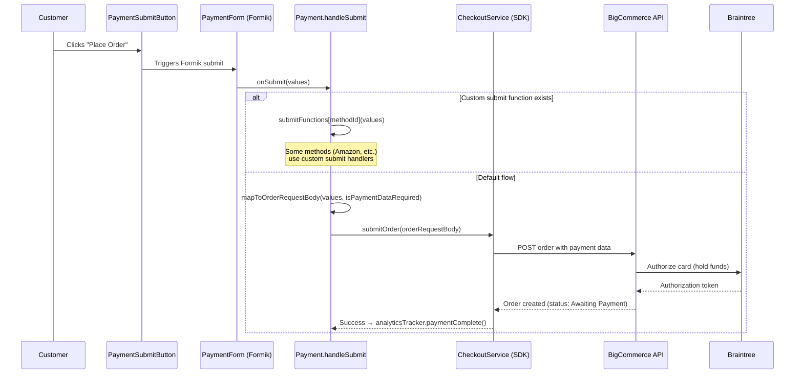

**`mapToOrderRequestBody`** ([mapToOrderRequestBody.ts](https://github.com/welldigital/bigcommerce-custom-checkout/blob/master/packages/core/src/app/payment/mapToOrderRequestBody.ts)) transforms form values into the SDK's `OrderRequestBody`:

```typescript
const { methodId, gatewayId } = parseUniquePaymentMethodId(paymentProviderRadio);
const payload: OrderRequestBody = {
    payment: { gatewayId, methodId },  // e.g. { gatewayId: undefined, methodId: 'braintree' }
};
// Attaches ccExpiry, ccNumber, ccCvv etc. as paymentData
```

**`handleSubmit`** ([Payment.tsx:440-484](https://github.com/welldigital/bigcommerce-custom-checkout/blob/master/packages/core/src/app/payment/Payment.tsx#L440-L484)):
```typescript
private handleSubmit = async (values) => {
    // Check for custom submit function (Amazon, etc.)
    const customSubmit = selectedMethod &&
        submitFunctions[getUniquePaymentMethodId(selectedMethod.id, selectedMethod.gateway)];

    if (customSubmit) {
        return customSubmit(values);
    }

    // Default: submit via BigCommerce SDK
    const state = await submitOrder(mapToOrderRequestBody(values, isPaymentDataRequired()));
    const order = state.data.getOrder();
    analyticsTracker.paymentComplete();
    onSubmit(order?.orderId);
};
```

---

## 3. Payment Methods — What's Active vs. Inherited

### Why Does the Checkout Have 70+ Payment Method Components?

`bigcommerce-custom-checkout` is a **fork** of BigCommerce's open-source checkout repository ([bigcommerce/checkout-js](https://github.com/bigcommerce/checkout-js)). Well Digital maintains the fork at `welldigital/bigcommerce-custom-checkout` and periodically merges upstream changes to stay current with BigCommerce's checkout SDK improvements.

The upstream repo is a **multi-tenant checkout** — it ships payment integrations for every payment provider that BigCommerce supports globally. When Well merges upstream, all these payment method components come along. They are **not Well Pharmacy code** — they are inherited open-source code that supports other BigCommerce stores.

### What's Actually Active for Well Pharmacy

Only **Braintree** is enabled as the payment gateway. The theme configuration confirms this:

**File:** [well-pharmacy-theme/config.json](https://github.com/welldigital/well-pharmacy-theme/blob/main/config.json)
```json
"supported_payment_methods": ["card", "paypal"],
"supported_card_type_icons": ["american_express", "diners", "discover", "mastercard", "visa"]
```

The `"paypal"` entry is **Braintree's PayPal integration** (not standalone PayPal) — Braintree acts as the intermediary for both card and PayPal payments.

| Active Payment Method | Component | How It Works |
|---|---|---|
| **Braintree Credit Card** | [BraintreeCreditCardPaymentMethod.tsx](https://github.com/welldigital/bigcommerce-custom-checkout/blob/master/packages/core/src/app/payment/paymentMethod/BraintreeCreditCardPaymentMethod.tsx) | Hosted card fields + 3D Secure modal. Primary payment method. |
| **PayPal (via Braintree)** | HostedPaymentMethod (generic) | Braintree's PayPal integration — BigCommerce routes PayPal through Braintree gateway |

### Integration Packages — Active vs. Inherited

The checkout contains **19 payment integration packages**. Only one is active for Well Pharmacy:

| Package | Payment Provider | Used by Well? |
|---------|-----------------|---------------|
| **braintree-integration** | Braintree (Accelerated Checkout, ACH, Local Methods) | **Yes** |
| adyen-integration | Adyen V2/V3 | No — inherited |
| afterpay-integration | Afterpay/Clearpay | No — inherited |
| apple-pay-integration | Apple Pay | No — inherited |
| barclay-integration | Barclaycard | No — inherited |
| bluesnap-direct-integration | BlueSnap | No — inherited |
| checkout-button-integration | Checkout buttons (PayPal, Amazon) | No — inherited |
| checkout-extension | Checkout extensions | No — inherited |
| credit-card-integration | Generic credit card | No — inherited |
| google-pay-integration | Google Pay | No — inherited |
| hosted-credit-card-integration | Hosted CC fields | No — inherited |
| hosted-dropin-integration | Drop-in UIs | No — inherited |
| hosted-field-integration | Hosted form fields | No — inherited |
| hosted-payment-integration | Hosted payment pages | No — inherited |
| hosted-widget-integration | Widget-based payments | No — inherited |
| offline-payment-integration | Bank transfer / offline | No — inherited |
| paypal-commerce-integration | PayPal Commerce Platform | No — inherited |
| paypal-connect-integration | PayPal Connect | No — inherited |
| squarev2-integration | Square | No — inherited |

### How Payment Methods Are Determined at Runtime

The code does **not** hardcode which payment methods to show. Instead, it's determined by **BigCommerce Store Admin configuration**:

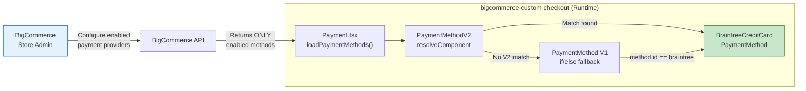

1. On checkout page load, `Payment.tsx` calls `checkoutService.loadPaymentMethods()` ([Payment.tsx:76,130](https://github.com/welldigital/bigcommerce-custom-checkout/blob/master/packages/core/src/app/payment/Payment.tsx#L76))
2. BigCommerce API returns **only the methods enabled in Store Admin** — for Well Pharmacy, this is just Braintree
3. The V2 resolver (`PaymentMethodV2.tsx`) attempts to find a matching component from the generated integration index
4. If no V2 match, falls back to V1 router (`PaymentMethod.tsx:72-240`) which has the `if (method.id === PaymentMethodId.Braintree)` branch
5. The 60+ other payment method components in the codebase **never execute** — they have no matching method from the API

### PaymentMethodId Constants

[PaymentMethodId.ts](https://github.com/welldigital/bigcommerce-custom-checkout/blob/master/packages/payment-integration-api/src/PaymentMethodId.ts) defines **66 payment method ID constants**. For Well Pharmacy, only the Braintree-related IDs are relevant:

| Constant | Value | Relevance |
|----------|-------|-----------|
| `Braintree` | `'braintree'` | **Primary** — credit card payments |
| `BraintreeAch` | `'braintreeach'` | Available in braintree-integration package |
| `BraintreeVenmo` | `'braintreevenmo'` | Available in braintree-integration package |
| `BraintreeGooglePay` | `'googlepaybraintree'` | Available but likely not enabled |
| `BraintreeVisaCheckout` | `'braintreevisacheckout'` | Available but likely not enabled |
| `BraintreeAcceleratedCheckout` | `'braintreeacceleratedcheckout'` | Available in braintree-integration package |
| `BraintreeLocalPaymentMethod` | `'braintreelocalmethods'` | Available in braintree-integration package |
| `BraintreePaypalCredit` | `'braintreepaypalcredit'` | PayPal Credit via Braintree |

> **Note:** Which of these Braintree sub-methods are actually enabled depends on BigCommerce Store Admin and Braintree merchant account configuration — not on the checkout code. The code supports all of them; the store config determines which appear.

### Well-Specific Customizations (Not Inherited)

While the payment method components are inherited, Well has made custom modifications to the checkout fork for pharmacy-specific features:

- Revenue events integration for Algolia product search
- Photo upload flow for clinical consultations
- Weight loss medicines (Wegovy) category handling
- Regulatory disclaimers and terms updates
- Custom checkout container styling

These customizations live in Well-specific feature branches (`feature/PT-*`, `feature/SWS-*`, `feature/wegovy-*`) merged into the main branch.

---

## 4. Braintree Integration (Full Stack)

### Frontend — Credit Card with 3D Secure

The Braintree credit card component is at [BraintreeCreditCardPaymentMethod.tsx](https://github.com/welldigital/bigcommerce-custom-checkout/blob/master/packages/core/src/app/payment/paymentMethod/BraintreeCreditCardPaymentMethod.tsx).

It wraps the generic `CreditCardPaymentMethod` and adds **3D Secure verification** via a modal:

```typescript
// BraintreeCreditCardPaymentMethod.tsx:45-72
const initializeBraintreePayment = useCallback(
    async (options, selectedInstrument) => {
        return initializePayment({
            ...options,
            braintree: {
                threeDSecure: {
                    addFrame(error, content, cancel) {
                        // Braintree SDK calls this to show 3DS iframe
                        setThreeDSecureContent(content);  // Shows modal
                        ref.current.cancelThreeDSecureVerification = cancel;
                    },
                    removeFrame() {
                        // Called when 3DS verification completes
                        setThreeDSecureContent(undefined);  // Closes modal
                    },
                },
                form: getHostedFormOptions && (await getHostedFormOptions(selectedInstrument)),
            },
        });
    },
    [getHostedFormOptions, initializePayment, onUnhandledError],
);
```

**How 3D Secure works here:**
1. Customer enters card details in hosted fields (PCI-compliant, rendered by Braintree)
2. On submit, BigCommerce SDK calls Braintree to authorize
3. If 3DS is required, Braintree calls `addFrame()` → a modal appears with the bank's verification iframe
4. Customer completes verification → Braintree calls `removeFrame()` → modal closes
5. Authorization completes with 3DS proof

### Frontend — Other Braintree Methods

| Method | Package | Component |
|--------|---------|-----------|
| ACH (bank account) | `braintree-integration` | [BraintreeAchPaymentMethod.tsx](https://github.com/welldigital/bigcommerce-custom-checkout/blob/master/packages/braintree-integration/src/BraintreeAch/BraintreeAchPaymentMethod.tsx) |
| Accelerated Checkout | `braintree-integration` | BraintreeAcceleratedCheckoutPaymentMethod |
| Local Methods (iDEAL, etc.) | `braintree-integration` | BraintreeLocalPaymentMethod |
| Google Pay | `core` | GooglePayPaymentMethod (with `googlepaybraintree` ID) |
| Visa Checkout | `core` | VisaCheckoutPaymentMethod |
| Venmo | `core` | HostedPaymentMethod |

### Backend — Braintree Gateway Initialization

**File:** [rule_engine/src/utils/utils.py:471-483](https://github.com/welldigital/rule_engine/blob/develop/src/utils/utils.py#L471-L483)

```python
def brain_tree_gateway():
    env = braintree.Environment.Sandbox
    if STAGE == 'prod':
        env = braintree.Environment.Production
    config = braintree.Configuration(
        environment=env,
        merchant_id=MERCHANT_ID,       # From AWS SSM Parameter Store
        public_key=PUBLIC_KEY,          # From AWS SSM Parameter Store
        private_key=PRIVATE_KEY)        # From AWS SSM Parameter Store
    gateway = braintree.BraintreeGateway(config)
    return gateway
```

**Configuration** ([rule_engine/src/serverless.yml:51-56](https://github.com/welldigital/rule_engine/blob/develop/src/serverless.yml#L51-L56)):
```yaml
MERCHANT_ID: ${ssm:braintree_merchant_id_${opt:stage, self:provider.stage}}
MERCHANT_ACCOUNT_ID: ${ssm:braintree_merchant_account_id_${opt:stage, self:provider.stage}}
PUBLIC_KEY: ${ssm:braintree_public_key_${opt:stage, self:provider.stage}}
PRIVATE_KEY: ${ssm:braintree_private_key_${opt:stage, self:provider.stage}}
```

### Authorize → Capture/Void Lifecycle

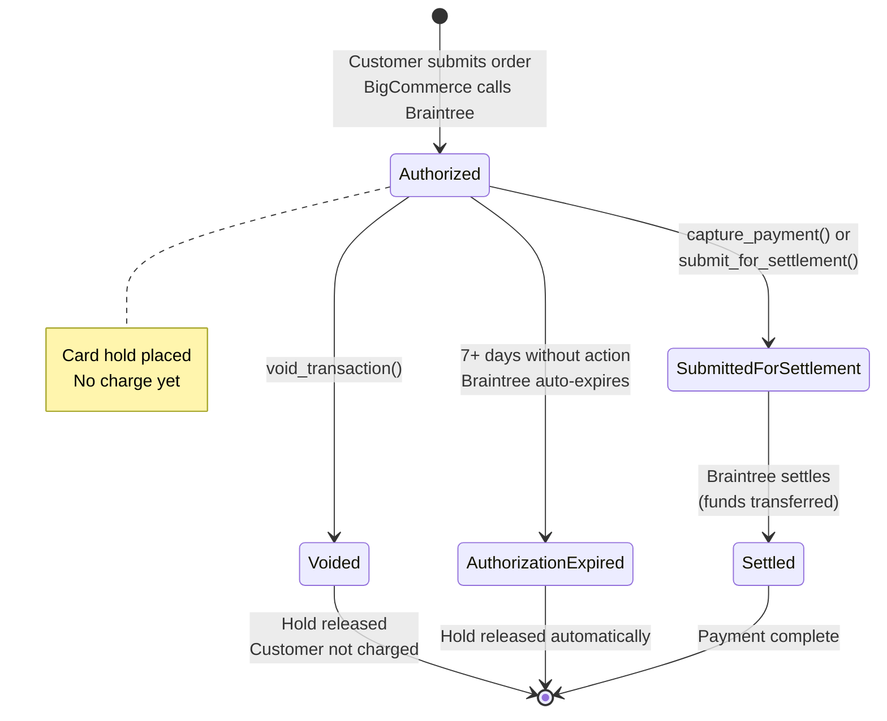

> **Key insight**: At checkout, BigCommerce only **authorizes** the card (places a hold). The actual **charge** happens later when the backend calls `capture_payment()`. This two-step flow enables pharmacist review before charging the customer.

---

## 5. Order Lifecycle & Payment State Machine

### Product Classification

Products determine the payment path:

| Category | Tag | Example | Payment Path |
|----------|-----|---------|--------------|
| **GSL** | General Sale List | Paracetamol, plasters | Auto-capture immediately |
| **GSL (age-restricted)** | GSL + `AccountRequired=true` | Nicotine patches, anti-allergy | ID check → auto-capture or manual review |
| **PMED** | Pharmacy Medicine | Codeine, some antihistamines | Always manual review |
| **POM** | Prescription Only Medicine | Antibiotics, strong painkillers | Always manual review |
| **Wegovy** | Special handling | Weight loss injection | First order: manual review. Subsequent doses: auto-capture if pre-approved |

### BigCommerce Status Codes

| Status ID | Name | Meaning |
|-----------|------|---------|
| `1` | Pending | Payment failed or deferred |
| `11` | Processing / Awaiting Fulfillment | Payment captured, order being fulfilled |
| `12` | Manual Verification Required | Needs pharmacist review before payment capture |

### State Machine

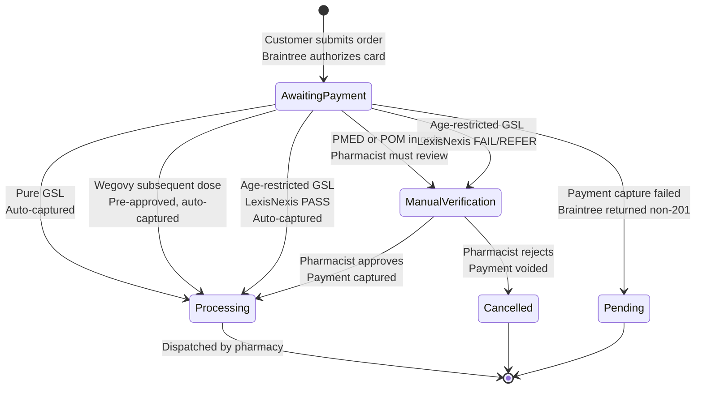

### Payment Decision Tree

This is the core logic in [order_status_change.go:234-297](https://github.com/welldigital/shop-webhooks/blob/main/src/handlers/order_status_change.go#L234-L297) — the active webhook handler. (A legacy Python implementation exists in [update_order.py](https://github.com/welldigital/rule_engine/blob/develop/src/lambdas/webhooks/update_order.py) but is **not deployed** — see Section 6.)

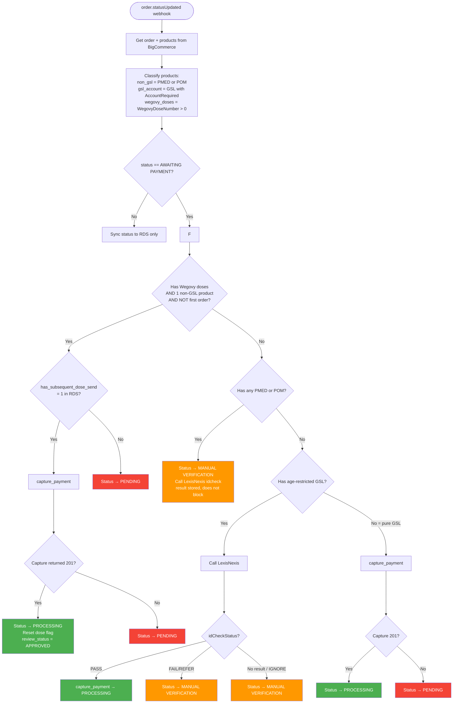

---

## 6. Webhook & Backend Processing — Service Responsibilities

### Architecture: shop-webhooks (Go) is the Sole Webhook Processor

A critical architectural detail: the `rule_engine` Python service **no longer handles BigCommerce webhooks**. The `CreateOrderWebhook` and `UpdateOrderWebhook` functions are **commented out** in [rule_engine/src/serverless.yml:208-249](https://github.com/welldigital/rule_engine/blob/develop/src/serverless.yml#L208-L249) and are not deployed. They are legacy code from an earlier architecture.

**All BigCommerce order webhooks are processed exclusively by `shop-webhooks` (Go).**

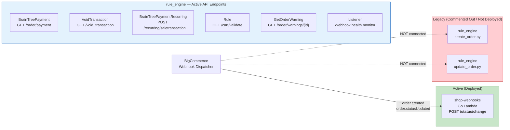

### shop-webhooks (Go) — The Active Webhook Handler

**Location:** [shop-webhooks/src/handlers/order_status_change.go](https://github.com/welldigital/shop-webhooks/blob/main/src/handlers/order_status_change.go)
**Endpoint:** `POST /status/change` ([functions.yml:11-69](https://github.com/welldigital/shop-webhooks/blob/main/serverless/conf/functions.yml#L11-L69))

This single handler processes **both** `order.created` and `order.statusUpdated` webhooks. It determines which phase to execute based on the previous and new status IDs:

```go
// order_status_change.go:152-298
func (h orderStatusChangeHandler) processOrderStatusChange(event types.WebHookEvent) error {
    orderProducts, err := h.bcAPI.GetOrderWithProducts(event.Data.ID)

    // Skip if no cart (subscription auto-generated orders)
    if orderProducts.CartID == "" {
        return h.crp.UpdateOrderStatus(orderProducts)
    }

    // If not AWAITING_PAYMENT or AWAITING_REVIEW → just sync status
    if event.Data.Status.NewStatusID != bcConst.STATUS_AWAITING_PAYMENT &&
        event.Data.Status.NewStatusID != bcConst.STATUS_AWAITING_REVIEW {
        return h.crp.UpdateOrderStatus(orderProducts)
    }

    // PHASE 1: Order Creation (when transitioning from INCOMPLETE)
    if event.Data.Status.PrevStatusID == bcConst.STATUS_INCOMPLETE {
        h.createOrder(orderProducts, nonGSLPdts, ...)
    }

    // PHASE 2: Payment Decision Tree
    if len(nonGSLPdts) == 1 && hasSubsequentPreapprovedProductDoseSend {
        h.capturePayment(orderProducts.ID, int(bcConst.STATUS_AWAITING_FULFILLMENT))
    } else if len(nonGSLPdts) > 0 {
        h.updateOrderStatus(orderProducts.ID, int(bcConst.STATUS_AWAITING_REVIEW))
    } else if len(ageRestrictedGSLPdts) > 0 {
        // ID check flow...
    } else {
        // Pure GSL → auto-capture
        h.capturePayment(orderProducts.ID, int(bcConst.STATUS_AWAITING_FULFILLMENT))
    }
}
```

**Order creation** ([order_status_change.go:300-405](https://github.com/welldigital/shop-webhooks/blob/main/src/handlers/order_status_change.go#L300-L405)) — triggered when `PrevStatusID == INCOMPLETE`:
1. Insert order and products into CRP MySQL via `h.crp.InsertOrderProducts()`
2. Update uploaded images via `h.crp.UpdateImages()`
3. Fetch Cognito ID and link Form Builder traversal via `h.traversalApi.UpdateTraversal()`
4. Insert traversal records per product via `h.crp.InsertTraversals()`
5. Fetch warning/exclusion counts via `h.traversalApi.GetWarningsAndExclusion()`
6. Create subscription if product has `Subscriptions=true` + `Purchase Type: Subscription` variant

**Payment capture** ([order_status_change.go:429-442](https://github.com/welldigital/shop-webhooks/blob/main/src/handlers/order_status_change.go#L429-L442)):
```go
func (h orderStatusChangeHandler) capturePayment(orderID, newStatusID int) error {
    err := h.bcAPI.CapturePayment(orderID)  // POST /v3/orders/{id}/payment_actions/capture
    if err != nil {
        h.updateOrderStatus(orderID, int(bcConst.STATUS_PENDING))  // Fallback to Pending
        return err
    }
    return h.updateOrderStatus(orderID, newStatusID)  // Set to Awaiting Fulfillment
}
```

**Additional capabilities:**
- Amplitude analytics tracking (user and order events)
- ClickUp error notifications for failures
- Cookie preference store (DynamoDB) for device tracking
- Pharmacy data integration
- Preapproved product (Wegovy) dose management

### rule_engine (Python) — Active API Endpoints Only

The `rule_engine` is **not** a webhook processor anymore. It serves as a set of **API endpoints** called by other services or the pharmacist admin:

| Function | Endpoint | Purpose | File |
|----------|----------|---------|------|
| `BrainTreePayment` | `GET /order/payment` | Submit Braintree transaction for settlement | [btpayment.py](https://github.com/welldigital/rule_engine/blob/develop/src/lambdas/payment/btpayment.py) |
| `VoidTransaction` | `GET /void_transaction` | Void a Braintree authorization | [void_transaction.py](https://github.com/welldigital/rule_engine/blob/develop/src/lambdas/payment/void_transaction.py) |
| `BrainTreePaymentRecurringTransaction` | `POST /order/payment/recurring/saletransaction` | Process recurring subscription payment | [subscription_btpayment_sale_transaction.py](https://github.com/welldigital/rule_engine/blob/develop/src/lambdas/payment/subscription_btpayment_sale_transaction.py) |
| `Rule` | `GET /cart/validate` | Cart validation rules | [rule_master.py](https://github.com/welldigital/rule_engine/blob/develop/src/lambdas/rules/rule_master.py) |
| `GetOrderWarning` | `GET /order/warnings/{order_id}` | Fetch order warning data | [get_warning.py](https://github.com/welldigital/rule_engine/blob/develop/src/lambdas/order_warnings/get_warning.py) |
| `Listener` | `POST /webhook/listener` + every 5 min | Monitor and reactivate failed webhooks | [listener.py](https://github.com/welldigital/rule_engine/blob/develop/src/lambdas/webhooks/listener.py) |

> **Key architectural insight**: The Go service (`shop-webhooks`) handles all webhook-driven order processing and payment capture via BigCommerce API (`h.bcAPI.CapturePayment()`). The Python service (`rule_engine`) provides **direct Braintree API access** for manual settlement, void, and subscription payments — operations that require the Braintree SDK and are called on-demand, not via webhooks.

### Legacy Code (Not Deployed)

The following files exist in the `rule_engine` codebase but are **not deployed** (commented out in [serverless.yml:208-270](https://github.com/welldigital/rule_engine/blob/develop/src/serverless.yml#L208-L270)):

| File | Original Purpose | Status |
|------|-----------------|--------|
| [create_order.py](https://github.com/welldigital/rule_engine/blob/develop/src/lambdas/webhooks/create_order.py) | `order.created` webhook handler | Superseded by `shop-webhooks` Go handler |
| [update_order.py](https://github.com/welldigital/rule_engine/blob/develop/src/lambdas/webhooks/update_order.py) | `order.statusUpdated` webhook handler | Superseded by `shop-webhooks` Go handler |
| `cart.py` | Cart webhook handler | Superseded by `shop-webhooks` cart-events handler |

These Python handlers contain the same payment decision logic that now lives in `order_status_change.go`. They are retained in the codebase but are dead code.

---

## 7. Sequence Diagrams

### 7.1 Pure GSL Order (Fast Path — Auto-Capture)

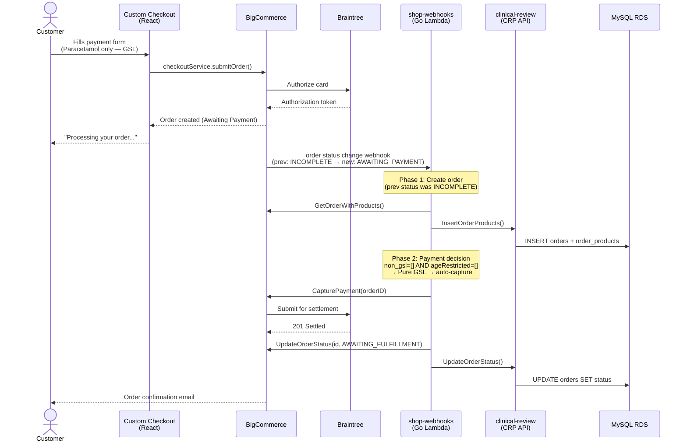

### 7.2 PMED/POM Order (Pharmacist Review)

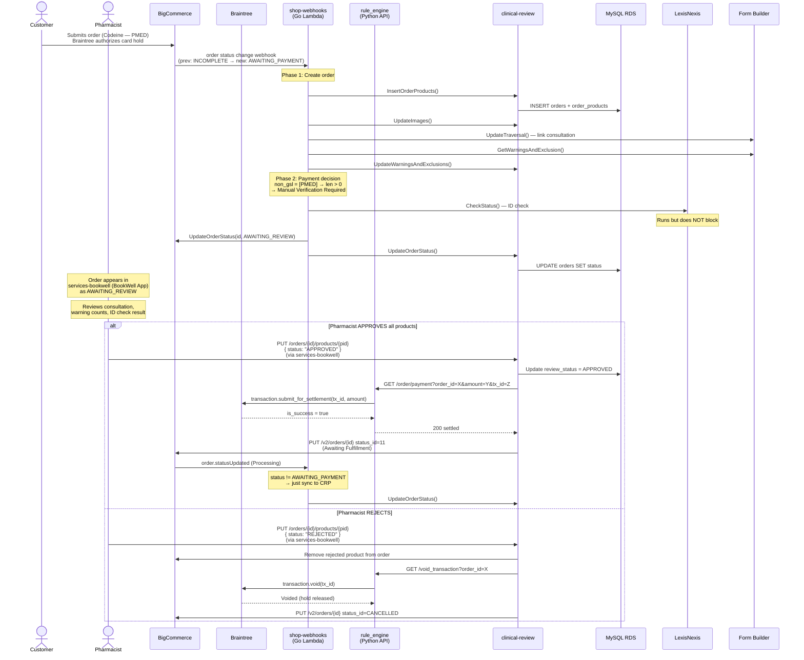

### 7.3 Age-Restricted GSL with ID Check

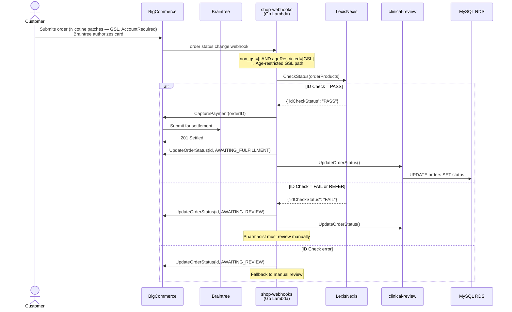

### 7.4 Wegovy Subscription — Subsequent Dose

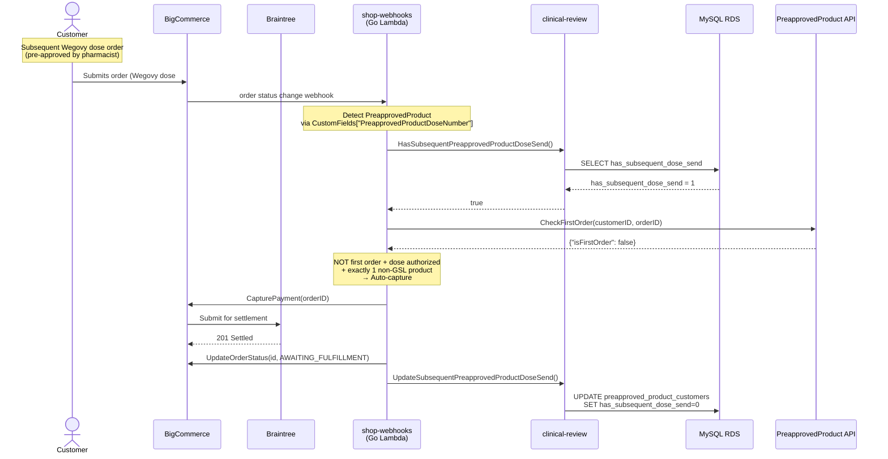

### 7.5 Subscription Recurring Payment (Sale Transaction)

For recurring subscription payments (Wegovy), a separate Lambda processes direct Braintree sale transactions:

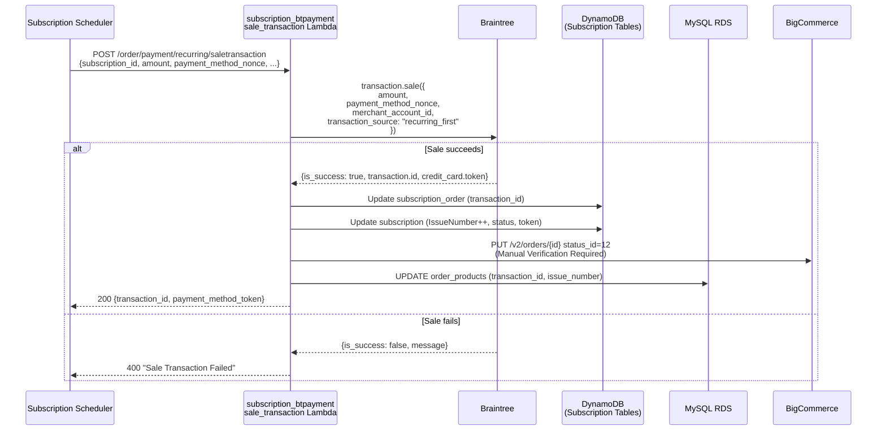

**File:** [subscription_btpayment_sale_transaction.py](https://github.com/welldigital/rule_engine/blob/develop/src/lambdas/payment/subscription_btpayment_sale_transaction.py)

---

## 8. Payment Capture & Settlement

There are **two distinct paths** to capture payment:

### Path 1: BigCommerce Capture API (Webhook-Driven, Automatic)

Used by the `shop-webhooks` Go handler when auto-capturing after product classification.

**File:** [order_status_change.go:429-442](https://github.com/welldigital/shop-webhooks/blob/main/src/handlers/order_status_change.go#L429-L442)

```go
func (h orderStatusChangeHandler) capturePayment(orderID, newStatusID int) error {
    err := h.bcAPI.CapturePayment(orderID)  // POST /v3/orders/{id}/payment_actions/capture
    if err != nil {
        h.updateOrderStatus(orderID, int(bcConst.STATUS_PENDING))
        return err
    }
    return h.updateOrderStatus(orderID, newStatusID)
}
```

BigCommerce internally tells Braintree to settle the authorized transaction. Called in these decision paths:
- Pre-approved subsequent dose (Wegovy) — [order_status_change.go:239](https://github.com/welldigital/shop-webhooks/blob/main/src/handlers/order_status_change.go#L239)
- Age-restricted GSL with LexisNexis PASS — [order_status_change.go:279](https://github.com/welldigital/shop-webhooks/blob/main/src/handlers/order_status_change.go#L279)
- Pure GSL auto-capture — [order_status_change.go:294](https://github.com/welldigital/shop-webhooks/blob/main/src/handlers/order_status_change.go#L294)

### Path 2: Direct Braintree Settlement (Pharmacist-Triggered via clinical-review)

This path bypasses BigCommerce entirely and settles the transaction directly with Braintree. It is **not triggered from the custom checkout frontend** — it is triggered by the **clinical-review (CRP) Go service** when a pharmacist takes action in **`services-bookwell`** (the BookWell/ServOS React app used across 700+ stores).

**Lambda:** [btpayment.py](https://github.com/welldigital/rule_engine/blob/develop/src/lambdas/payment/btpayment.py)
**Endpoint:** `GET /order/payment?order_id=X&amount=Y&tx_id=Z`

#### Who Triggers It — Three Scenarios

The clinical-review service calls the `rule_engine` `/order/payment` endpoint from three distinct code paths. All use the same `PAYMENT_CAPTURE_SERVICE_BASE_URL` config ([config.example.yml:29](https://github.com/welldigital/clinical-review/blob/main/config.example.yml#L29)):

**1. Pharmacist approves an order containing ONLY age-restricted GSL items**

When a pharmacist approves an order via `PUT /orders/{id}` with `status: "APPROVE"`:

```
services-bookwell (BookWell App)
  → PUT /orders/{id} { status: "APPROVE" }
    → clinical-review: UpdateOrder() (order_service.go:859)
      → handleOrderApprove() (order_service.go:885)
        → checks if ALL products are GSL (order_service.go:904-908)
        → if yes (GSL-only): handlePayment(orderID, amount, payment_capture) (order_service.go:924)
          → GET /order/payment?order_id=X&amount=Y  → rule_engine btpayment.py
        → if no (has PMED/POM): only approves age-restricted GSL items, does NOT capture
```

[order_service.go:885-938](https://github.com/welldigital/clinical-review/blob/main/src/order/service/order_service.go#L885-L938) — note that if the order has any non-GSL items, payment is NOT captured here. Only pure-GSL-but-age-restricted orders get captured at this point.

**2. Pharmacist approves/rejects individual products in an order**

When a pharmacist reviews products one-by-one via `PUT /orders/{order_id}/products/{product_id}`:

```
services-bookwell (BookWell App)
  → PUT /orders/{order_id}/products/{product_id} { status: "APPROVED" or "REJECTED" }
    → clinical-review: UpdateProductStatus() (product_service.go)
      → recalculates order amount (removes rejected products from BC)
      → if final BC status != AWAITING_REVIEW AND updatedOrderAmt > 0:
          → GET /order/payment?order_id=X&amount=Y&tx_id=Z  → rule_engine btpayment.py
      → then updates order status in BigCommerce
```

[product_service.go:318-345](https://github.com/welldigital/clinical-review/blob/main/src/product/service/product_service.go#L318-L345) — this is the most common path for PMED/POM orders. The pharmacist reviews each product, and once all products have been reviewed (none left in AWAITING_REVIEW), the payment is captured for the final approved amount. If a product is rejected, it is removed from the BigCommerce order first, and the settlement amount is adjusted accordingly.

**3. ID check passes for age-restricted GSL (automated, not pharmacist-initiated)**

When a LexisNexis ID check result comes back as PASS via `PUT /customers/{id}/idchecks`:

```
LexisNexis callback or admin update
  → PUT /customers/{id}/idchecks { status: "PASS" }
    → clinical-review: UpdateIDCheckStatus() (idcheck_service.go)
      → ApproveAllIDCheck() (idcheck_service.go:119)
        → GET /order/payment?order_id=X&amount=Y  → rule_engine btpayment.py
```

[idcheck_service.go:104-147](https://github.com/welldigital/clinical-review/blob/main/src/idcheck/service/idcheck_service.go#L104-L147)

#### Full Sequence Diagram — Pharmacist Product Approval (Most Common Path)

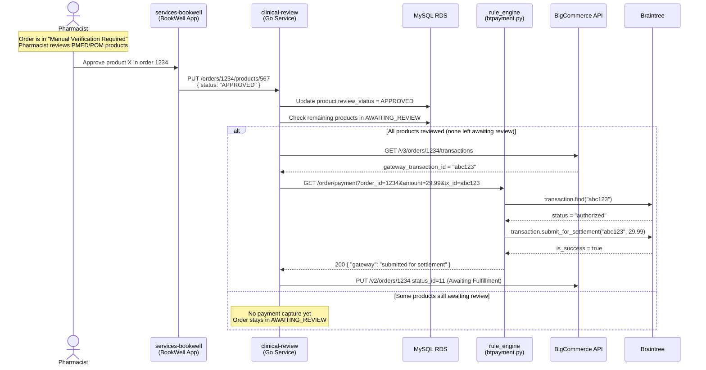

#### What btpayment.py Actually Does

The Lambda receives `order_id`, `amount`, and optionally `tx_id` as query parameters:

```python
# btpayment.py — two branches depending on whether tx_id is provided

if tx_id == "":
    # Path A: Look up transaction ID from BigCommerce API
    transaction_id = get_transactions_by_order_id(order_id)  # GET /v3/orders/{id}/transactions
    transaction = brain_tree_gateway().transaction.find(transaction_id)
    if transaction.status == 'authorized':
        result = brain_tree_gateway().transaction.submit_for_settlement(transaction_id, amount)
else:
    # Path B: tx_id already known (passed by clinical-review product_service)
    transaction = brain_tree_gateway().transaction.find(tx_id)
    if transaction.status == 'authorized':
        result = brain_tree_gateway().transaction.submit_for_settlement(tx_id, amount)
```

If the transaction is not in `authorized` status (e.g., already settled, voided, or expired), it returns `409 Conflict`.

**Get transaction ID from BigCommerce** ([utils.py:397-420](https://github.com/welldigital/rule_engine/blob/develop/src/utils/utils.py#L397-L420)):
```python
def get_transactions_by_order_id(order_id):
    url = STORE_URL + STORE_HASH + "/v3/orders/{0}/transactions".format(order_id)
    response = r.request("GET", url, headers=headers)
    transaction_id = next((i['gateway_transaction_id'] for i in json_response['data']
                          if i['gateway_transaction_id'] != ""), "")
    return transaction_id
```

#### Key Difference from Path 1

| | Path 1 (BigCommerce Capture API) | Path 2 (Direct Braintree Settlement) |
|---|---|---|
| **Triggered by** | `shop-webhooks` Go Lambda (automatic) | `clinical-review` Go service (pharmacist action) |
| **When** | Immediately after order creation, during webhook processing | After pharmacist reviews and approves products |
| **API call** | `POST /v3/orders/{id}/payment_actions/capture` (BigCommerce) | `brain_tree_gateway().transaction.submit_for_settlement()` (Braintree SDK) |
| **Use cases** | Pure GSL, pre-approved Wegovy, age-restricted GSL with ID PASS | PMED/POM after pharmacist review, age-restricted GSL order approval |
| **Amount** | Full order amount (BigCommerce handles it) | Specific amount passed as parameter (may be reduced if products were rejected) |

### Payment Void (Cancellation)

The void flow is triggered by the same clinical-review service, through the same `handlePayment()` function but with `operation == payment_void` ([order_service.go:1187-1203](https://github.com/welldigital/clinical-review/blob/main/src/order/service/order_service.go#L1187-L1203)), or from `product_service.go` when all products are rejected and the order is cancelled ([product_service.go:199-216](https://github.com/welldigital/clinical-review/blob/main/src/product/service/product_service.go#L199-L216)).

**Lambda:** [void_transaction.py](https://github.com/welldigital/rule_engine/blob/develop/src/lambdas/payment/void_transaction.py)
**Endpoint:** `GET /void_transaction?order_id=X&tx_id=Y`

```python
# void_transaction.py:16-29
transaction = brain_tree_gateway().transaction.find(transaction_id)
if transaction.status.lower() == 'authorized':
    result = brain_tree_gateway().transaction.void(transaction_id)
    # Returns: {"gateway": "transaction voided"}
elif transaction.status.lower() == 'authorization_expired':
    # Braintree already auto-voided after ~7 days
    # Returns: {"gateway": "transaction voided from authorization expired"}
```

**Trigger flow:**
```
Pharmacist rejects all products (or order)
  → clinical-review: handleRejectAll() or UpdateProductStatus(status=REJECTED)
    → if order cancelled: GET /void_transaction?order_id=X  → rule_engine void_transaction.py
    → then: PUT /v2/orders/{id} status_id=CANCELLED in BigCommerce
```

The void releases the hold on the customer's card — the customer is never charged. If the authorization has already expired (~7 days), Braintree auto-voids it, and the Lambda handles this gracefully.

---

## 9. External Service Integrations

### LexisNexis ID Verification

**Purpose:** Age verification for restricted products (nicotine, certain medicines).

**Called by:** `shop-webhooks` Go handler via `h.idCheckApi.CheckStatus(orderProducts)` ([order_status_change.go:256,272](https://github.com/welldigital/shop-webhooks/blob/main/src/handlers/order_status_change.go#L256))

The ID check API is implemented in the [shop-webhooks/src/idcheck/](https://github.com/welldigital/shop-webhooks/blob/main/src/idcheck/) package, which calls the clinical-review LexisNexis endpoint:
```
POST /customers/{customer_id}/idchecks
```

| Response | Action |
|----------|--------|
| `PASS` | Auto-capture payment |
| `FAIL` | Route to Manual Verification (AWAITING_REVIEW) |
| `REFER` | Route to Manual Verification (AWAITING_REVIEW) |
| `IGNORE` | Route to Manual Verification (AWAITING_REVIEW) |
| API error | Route to Manual Verification (AWAITING_REVIEW) — fail-safe |

### Subscription Service

**Purpose:** Manage recurring orders (Wegovy weight loss program).

**Called by:** `shop-webhooks` Go handler during order creation ([order_status_change.go:380-401](https://github.com/welldigital/shop-webhooks/blob/main/src/handlers/order_status_change.go#L380-L401)):

```go
// Create subscription when product has Subscriptions=true AND Purchase Type=Subscription variant
if strings.EqualFold(li.CustomFields["Subscriptions"], "true") &&
    li.HasProductOption("Purchase Type", "Subscription") {
    subs, err := h.subscriptionApi.CreateSubscription(orderProducts.CartID, orderProducts.CustomerID, li)
    // Then update CRP with subscription attributes
    h.crp.UpdateSubscriptionAttributes(li, subs, maxIssueLimit)
}
```

Subscriptions are created when a product has:
- Custom field `Subscriptions` = `"true"`
- Product option `Purchase Type` = `Subscription`

For recurring payment processing (subsequent doses), the `rule_engine` Python API handles direct Braintree sale transactions via [subscription_btpayment_sale_transaction.py](https://github.com/welldigital/rule_engine/blob/develop/src/lambdas/payment/subscription_btpayment_sale_transaction.py).

### Form Builder / Traversal API

**Purpose:** Links clinical consultation questionnaire data to orders.

**Called by:** `shop-webhooks` Go handler during order creation ([order_status_change.go:337-377](https://github.com/welldigital/shop-webhooks/blob/main/src/handlers/order_status_change.go#L337-L377)):
- `h.traversalApi.UpdateTraversal()` — links the consultation to the order
- `h.crp.InsertTraversals()` — persists traversal IDs per product
- `h.traversalApi.GetWarningsAndExclusion()` — retrieves warning and exclusion counts for PMED/POM products

Warning counts help pharmacists assess clinical risk during manual review.

### Webhook Health Monitor

**File:** [rule_engine/src/lambdas/webhooks/listener.py](https://github.com/welldigital/rule_engine/blob/develop/src/lambdas/webhooks/listener.py)

Runs every 5 minutes (scheduled) to detect and reactivate failed BigCommerce webhooks:

```python
def process_webhook_failure():
    # GET all webhooks from BigCommerce
    # Find any that are not is_active
    # Reactivate via PUT /v3/hooks/{id}
```

---

## 10. Key File Reference

### Frontend (bigcommerce-custom-checkout)

| File | Purpose |
|------|---------|
| [Payment.tsx](https://github.com/welldigital/bigcommerce-custom-checkout/blob/master/packages/core/src/app/payment/Payment.tsx) | Main payment orchestrator, handleSubmit (L440-484), state management |
| [PaymentForm.tsx](https://github.com/welldigital/bigcommerce-custom-checkout/blob/master/packages/core/src/app/payment/PaymentForm.tsx) | Formik form wrapper, initial values, validation |
| [PaymentMethod.tsx](https://github.com/welldigital/bigcommerce-custom-checkout/blob/master/packages/core/src/app/payment/paymentMethod/PaymentMethod.tsx) | V1 method router — if/else chain (L72-240) |
| [PaymentMethodV2.tsx](https://github.com/welldigital/bigcommerce-custom-checkout/blob/master/packages/core/src/app/payment/paymentMethod/PaymentMethodV2.tsx) | V2 method resolver with dynamic component loading |
| [BraintreeCreditCardPaymentMethod.tsx](https://github.com/welldigital/bigcommerce-custom-checkout/blob/master/packages/core/src/app/payment/paymentMethod/BraintreeCreditCardPaymentMethod.tsx) | Braintree CC with 3D Secure modal |
| [mapToOrderRequestBody.ts](https://github.com/welldigital/bigcommerce-custom-checkout/blob/master/packages/core/src/app/payment/mapToOrderRequestBody.ts) | Transforms form values → OrderRequestBody |
| [PaymentMethodId.ts](https://github.com/welldigital/bigcommerce-custom-checkout/blob/master/packages/payment-integration-api/src/PaymentMethodId.ts) | All payment method ID constants |
| [PaymentContext.tsx](https://github.com/welldigital/bigcommerce-custom-checkout/blob/master/packages/core/src/app/payment/PaymentContext.tsx) | Payment context (disableSubmit, setSubmit, etc.) |
| [BraintreeAchPaymentMethod.tsx](https://github.com/welldigital/bigcommerce-custom-checkout/blob/master/packages/braintree-integration/src/BraintreeAch/BraintreeAchPaymentMethod.tsx) | Braintree ACH bank payments |

### Backend — shop-webhooks (Go) — Active Webhook Processor

| File | Purpose |
|------|---------|
| [order_status_change.go](https://github.com/welldigital/shop-webhooks/blob/main/src/handlers/order_status_change.go) | **Primary handler** — order creation + payment decision tree + status updates |
| [functions.yml](https://github.com/welldigital/shop-webhooks/blob/main/serverless/conf/functions.yml) | Lambda function definitions (endpoints, IAM, env vars) |
| [serverless.yml](https://github.com/welldigital/shop-webhooks/blob/main/serverless/serverless.yml) | Service configuration |

### Backend — rule_engine (Python) — Active API Endpoints

| File | Purpose |
|------|---------|
| [btpayment.py](https://github.com/welldigital/rule_engine/blob/develop/src/lambdas/payment/btpayment.py) | `GET /order/payment` — Manual Braintree settlement |
| [subscription_btpayment_sale_transaction.py](https://github.com/welldigital/rule_engine/blob/develop/src/lambdas/payment/subscription_btpayment_sale_transaction.py) | `POST /order/payment/recurring/saletransaction` — Recurring subscription payment |
| [void_transaction.py](https://github.com/welldigital/rule_engine/blob/develop/src/lambdas/payment/void_transaction.py) | `GET /void_transaction` — Payment void/cancellation |
| [utils.py](https://github.com/welldigital/rule_engine/blob/develop/src/utils/utils.py) | BigCommerce API calls, Braintree gateway init |
| [constants.py](https://github.com/welldigital/rule_engine/blob/develop/src/utils/constants.py) | Environment variable loading |
| [serverless.yml](https://github.com/welldigital/rule_engine/blob/develop/src/serverless.yml) | Lambda configuration (note: webhook functions commented out at L208-270) |
| [listener.py](https://github.com/welldigital/rule_engine/blob/develop/src/lambdas/webhooks/listener.py) | Webhook health monitor (reactivates failed webhooks every 5 min) |

### Backend — rule_engine (Python) — Legacy / Not Deployed

| File | Purpose | Status |
|------|---------|--------|
| [create_order.py](https://github.com/welldigital/rule_engine/blob/develop/src/lambdas/webhooks/create_order.py) | Was `order.created` webhook handler | Superseded by Go `order_status_change.go` |
| [update_order.py](https://github.com/welldigital/rule_engine/blob/develop/src/lambdas/webhooks/update_order.py) | Was `order.statusUpdated` webhook handler | Superseded by Go `order_status_change.go` |
| [rds_utils.py](https://github.com/welldigital/rule_engine/blob/develop/src/utils/rds_utils.py) | MySQL operations (used by legacy webhook handlers) | Still used by active payment endpoints |

### Pharmacist Admin — services-bookwell (React/TypeScript)

| File | Purpose |
|------|---------|
| [ClinicalReviewApi.ts](https://github.com/welldigital/services-bookwell/blob/dev/src/pages/ClinicalReviewPage/ClinicalReviewApi.ts) | API client for clinical-review service — all approve/reject/idcheck HTTP calls |
| [ClinicalReviewPage.tsx](https://github.com/welldigital/services-bookwell/blob/dev/src/pages/ClinicalReviewPage/ClinicalReviewPage.tsx) | Main order list UI — shows orders in AWAITING_REVIEW |
| [AddComment.tsx](https://github.com/welldigital/services-bookwell/blob/dev/src/pages/ClinicalReviewPage/OrderDetails/OrderItemsForReview/CommentSection/AddComment.tsx) | Product approve/reject UI with mandatory review comments |
| [UpdateStatusDetails.tsx](https://github.com/welldigital/services-bookwell/blob/dev/src/pages/ClinicalReviewPage/OrderDetails/UpdateStatus/UpdateStatusDetails.tsx) | ID check status update flow |
| [Types.ts](https://github.com/welldigital/services-bookwell/blob/dev/src/pages/ClinicalReviewPage/Types.ts) | TypeScript interfaces for orders, products, review statuses |

### Backend — clinical-review (Go)

| File | Purpose |
|------|---------|
| [order_service.go](https://github.com/welldigital/clinical-review/blob/main/src/order/service/order_service.go) | Order approval/rejection logic, calls rule_engine for payment capture/void |
| [product_service.go](https://github.com/welldigital/clinical-review/blob/main/src/product/service/product_service.go) | Per-product approval/rejection, recalculates order amount, triggers payment |
| [idcheck_service.go](https://github.com/welldigital/clinical-review/blob/main/src/idcheck/service/idcheck_service.go) | ID check status updates, auto-captures payment on PASS |
| [schema.sql](https://github.com/welldigital/clinical-review/blob/main/schema.sql) | Database schema (orders, order_products, preapproved_product_customers) |
| [config.example.yml](https://github.com/welldigital/clinical-review/blob/main/config.example.yml) | Configuration with PAYMENT_CAPTURE_SERVICE URLs |

### Existing Documentation

| File | Purpose |
|------|---------|
| [03-order-lifecycle.md](https://github.com/welldigital/rule_engine/blob/develop/docs/03-order-lifecycle.md) | Detailed order lifecycle docs with Mermaid diagrams |
